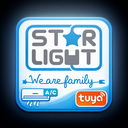

# Starlight AC Tuya Home Assistant Integration



[](https://github.com/custom-components/hacs)
[](https://github.com/jimytar/starlight-ac-tuya/releases)

## About

This integration is specifically designed for **Star-Light AC models** (ACT-09TSWF, ACT-12TSWF, ACT-18TSWF) that use SmartLife with proprietary firmware and custom data points (DPs).

### Why This Integration?

Star-Light air conditioners use **custom Tuya data points** that are not compatible with the standard Home Assistant Tuya integration. With the default Tuya integration, you can **only adjust temperature** - all other features (HVAC modes, fan speeds, eco mode, etc.) are inaccessible due to the proprietary DPs.

This integration provides **full control** by mapping the custom DPs correctly:
- All HVAC modes (auto, cool, heat, dry, fan)
- Fan speed control
- Eco mode, health mode
- Display light, beep control
- Real-time temperature monitoring
 - Horizontal and vertical airflow control (swing) and auto oscillation

Since these models require **cloud-only control** (no local tuya-local support), this integration uses the Tuya OpenAPI for reliable cloud communication.

## Features

- **Climate Control**: Full climate entity with temperature control and mode selection
- **HVAC Modes**: Auto, Cool, Heat, Dry, Fan, Off
- **Temperature Control**: Set target temperature (16-31°C / 61-88°F)
- **Fan Modes**: Low, Medium, High, Auto
**Extra Switches**: 
  - Eco mode
  - Turbo (fan boost)
  - Mute (reduced fan noise)
  - Sleep (silent mode)
  - Health mode
  - Beep control
  - Display light
- **Real-time Updates**: Automatic polling every 30 seconds
- **Multiple Devices**: Support for multiple AC units
- **Config Flow**: Easy setup through UI

## Prerequisites

You will need Tuya IoT Platform credentials:
- **Access ID** / Client ID
- **Access Secret** / Client Secret
- **Device ID(s)** for your air conditioner(s)

### Getting Tuya Credentials

1. Go to [Tuya IoT Platform](https://iot.tuya.com/)
2. Create an account and log in
3. Create a **Cloud Project** → Select **Smart Home** → Choose your data center region
4. Go to your project → **Overview** → Copy **Access ID** and **Access Secret**
5. Go to **Devices** → **Link Tuya App Account** → Scan QR code with Tuya Smart app
6. Go to **API** → Select **IoT Core** and **Authorization** API groups and subscribe
7. Find your device ID in **Devices** section

Important: ensure all device data points (DP codes) are enabled for your devices in the Tuya Cloud project. Without enabling the required DPs, this integration cannot access many features (fan modes, eco, turbo, sleep, etc.). See the guide: https://github.com/azerty9971/xtend_tuya/blob/main/docs/enable_all_dpcodes.md

## Installation

### HACS (Recommended)

1. Open HACS in Home Assistant
2. Go to **Integrations**
3. Click the **⋮** menu (top right) → **Custom repositories**
4. Add repository URL: `https://github.com/jimytar/starlight-ac-tuya`
5. Category: **Integration**
6. Click **Add**
7. Find "Starlight AC Tuya" in HACS and click **Download**
8. Restart Home Assistant

### Manual Installation

1. Download the latest release from [GitHub releases](https://github.com/jimytar/starlight-ac-tuya/releases)
2. Extract and copy the `custom_components/starlight_ac_tuya` folder to your Home Assistant `config/custom_components/` directory
3. Restart Home Assistant

## Configuration

1. Go to **Settings** → **Devices & Services**
2. Click **Add Integration**
3. Search for **Starlight AC Tuya**
4. Enter your Tuya credentials:
   - Access ID (Client ID)
   - Access Secret (Client Secret)
   - Device ID
5. Click **Submit**

Your AC will be added as:
- Climate entity (e.g., `climate.living_room_ac`)
- Multiple switch entities for extra features
- Sensor entities for current temperature

## Usage

### Climate Entity

Control your AC through the climate card:
- Set target temperature
- Change HVAC mode (auto, cool, heat, dry, fan, off)
- Adjust fan speed
 - Control airflow direction: horizontal and vertical swing, and enable/disable auto oscillation

### Switches

Additional switches for:
- `switch.{device}_eco` - Eco mode
- `switch.{device}_turbo` - Turbo (fan boost)
- `switch.{device}_mute` - Mute (reduced fan noise)
- `switch.{device}_sleep` - Sleep mode (0/1)
- `switch.{device}_health` - Health/ionizer mode
- `switch.{device}_beep` - Beep sounds
 
- `switch.{device}_light` - Display light

## Supported Devices

This integration is specifically designed and tested for **Star-Light AC models**:
- **ACT-09TSWF** (9000 BTU)
- **ACT-12TSWF** (12000 BTU)
- **ACT-18TSWF** (18000 BTU)

These models use SmartLife app with proprietary Tuya data points (category `kt`). Other Tuya AC models with standard DPs should use the official Home Assistant Tuya integration instead.

## Troubleshooting

### "Failed to authenticate"
- Verify your Access ID and Access Secret are correct
- Check that your device is linked to your Tuya account
- Ensure API subscriptions are active (IoT Core, Authorization)

### "Device not found"
- Verify the Device ID is correct
- Make sure device is online in Tuya app
- Check device is category `kt` (air conditioner)

### Entity not updating
- Check your internet connection
- Verify Tuya API quota hasn't been exceeded
- Try reloading the integration

## Development

To contribute or test locally:

```bash
git clone https://github.com/jimytar/starlight-tuya-ac.git
cd starlight-tuya-ac
# Copy to your Home Assistant config directory
cp -r custom_components/starlight_tuya_ac /path/to/homeassistant/config/custom_components/
```

## Support

If you find this integration useful, please ⭐ star the repository!

For bugs or feature requests, please [open an issue](https://github.com/jimytar/starlight-ac-tuya/issues).

## License

MIT License - see LICENSE file for details

## Credits

Developed by [@jimytar](https://github.com/jimytar)